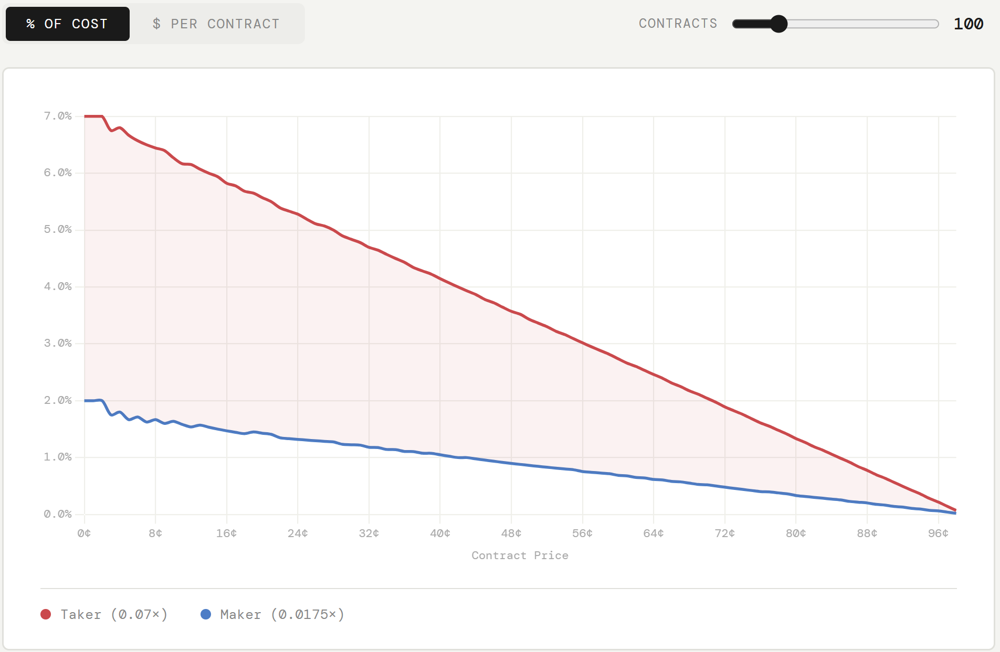

# Execution Fee

Owner: quang
Created time: February 20, 2026 3:29 PM
Last edited: February 20, 2026 3:58 PM

# Polymarket

None

# Kalshi Fee Schedule

### Taker

```jsx
fees = round up(0.07 x C x P x (1-P)) 
P = the price of a contract in dollars (50 cents is 0.5) 
C = the number of contracts being traded 
round up = rounds to the next cent 
```

### Maker

```jsx
fees = round up(0.0175 x C x P x (1-P)) 
P = the price of a contract in dollars (50 cents is 0.5) 
C = the number of contracts being traded 
round up = rounds to the next cent 
```



